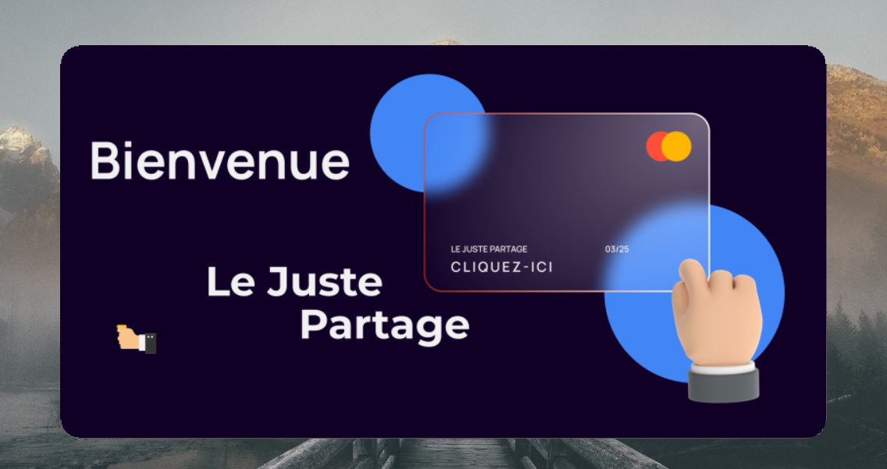
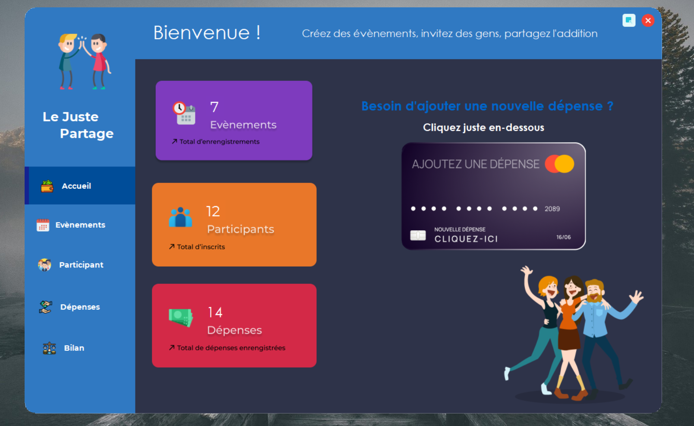

<h1 align="center"> 
   Good accounts make good friends
</h1>

Your best application for accounting.

# Project Title

Application allowing the complete management of the expenses made during an event (collocation, weekend, holidays...) organized in group.

  

# Table of content

- [Project Title](#project-title)
- [Table of content](#table-of-content)
- [Open the project](#open-the-project)
- [Test the application](#test-the-application)
- [Authors](#authors)

# Presentation 

https://user-images.githubusercontent.com/62793491/161386682-7b924dfb-6deb-49c6-b60b-805065f831a5.mp4

# Open the project

- To open the project go to : `/projetEvents/projetEvents.sln `

# Test the application

- To open the application, go to : `/projetEvents/Events/bin/Debug/projetEvents.exe`

# Authors

- Developped by : **Julien Von Der Marck**
- Other developper : Jad MACHKOUR and Lassabliere_Gautier
